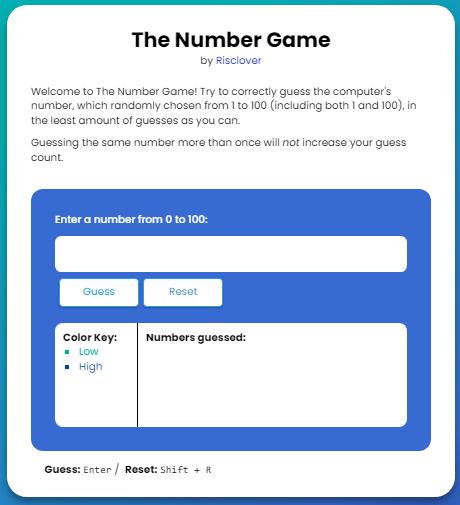
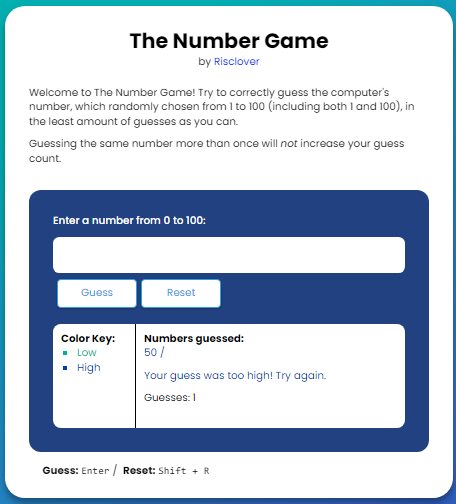
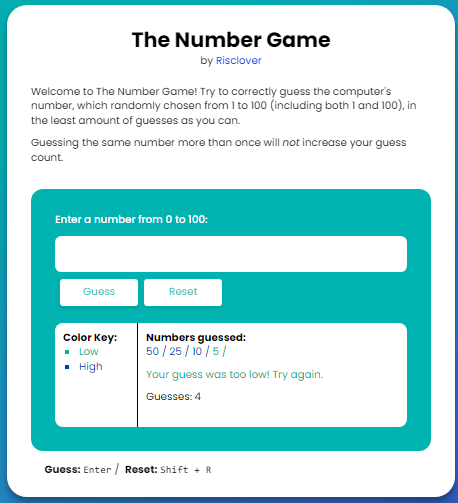
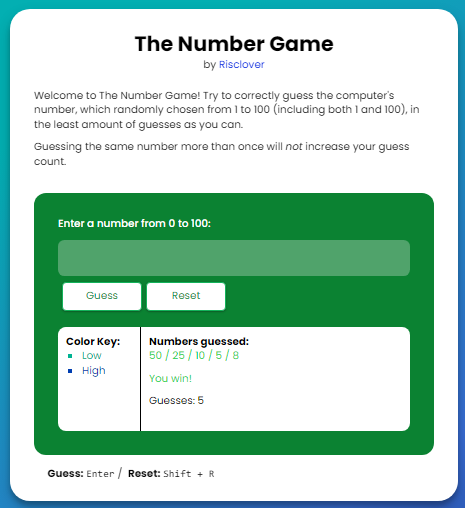
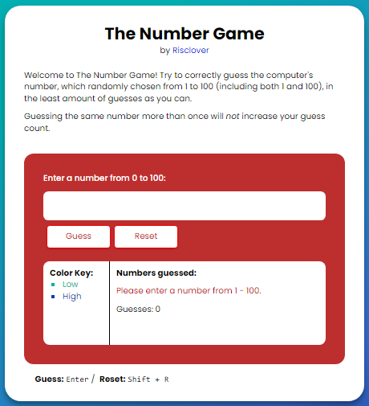
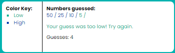

# Introduction
 A numbers guessing game built with HTML, CSS, JavaScript, and jQuery.

 

### Table of Contents
1. [Introduction](#introduction) (You are here)
2. [Description](#description)
3. [Updates](#updates)
4. [Instructions](#instructions)
5. [Build](#build)
6. [Links](#links)

## Description
([Back to top ^](#introduction))

A game in which the player tries to guess the number - which is randomly chosen from 1 - 100 at the start of each game - in the least number of guesses possible.

## Updates
([Back to top ^](#introduction))

- **12/28/21**: After returning to this project to put it on my [portfolio](https://risclvoer.github,io/The-Number-Game), I had the idea to make it so that players can use their keyboard to play if they want (because as of then, players were only able to play via clicking the Guess and Reset buttons with their mouse). To go ahead with simulating the "Guess" button, the player can press Enter. To simulate pressing the "Reset" button, the player can hit the D key.

- **02/25/2022**: I've once again returned to this project, this time to write a "Project Breakdown" blog post for the [aforementioned portfolio](https://risclvoer.github.io/The-Number-Game). I've changed quite a bit this time, the biggest thing being refactoring my JavaScript code into (mostly) jQuery. I've also added some little odds and ends, including the following, taken directly from my [Project Breakdown post](https://risclover.github.io/official-portfolio/blog/project_breakdown_number_game.html/):
    - The keyboard shortcut for the Reset button. Why is it 'd'? I don't know. I think it should instead be Shift + R.
    - Change the text color for when there is an error (make it red instead of allowing it to stay the same as it was previously)
    - When testing my game just now, I realized that you can get the number 0. So I need to change the text that says "From 1 - 100" or "1 to 100" to say "0 - 100". I also want to add, "(Including 0 and 100)".
    - Throw an error when the player tries to submit an input with text

- **03/20/2022**: After a quick look at this project, I realized there were a couple of errors that I needed to fix.
    - During the last update (and jQuery refactor), my code to generate the random number was as follows:

        ```javascript
        let gameNumber = Math.floor(Math.random() * 100);
        ```

        This resulted in my random number being from 0 - 99 instead of from 1 - 100 like I wanted. I didn't know how to fix this, so I just changed my description to let the player know to guess from 0 - 100 and went about my business. 

        Well, unrelated to this, I happened to figure out how to start from 1 instead of 0 (something that is easily Google-able, by the way... I'm just dumb) just yesterday, coincidentally. So when I revisited this project today and realized that I could fix this mistake, I did.  

        For the record, the solution for this is as follows:

        ```javascript
        let gameNumber = Math.floor(Math.random() * 100 + 1); 
        ```

        TL;DR: The range is back to 1-100, and is actually from 1-100 instead of 0-99.

  -  An error that I <em>wasn't</em> aware of last time was that, when there is nothing in the input box and the player presses Guess (or Enter), the game treats it as a non-duplicable guess and appends an empty slash to the "guess board". After seeing that this time, I added the condition of an empty input box to the list of things that generates an error.

## Instructions
The Number Game is a number guessing game. You must try to guess the winning number, which is a randomly-generated number between 1 and 100. The game will help you out along the way by letting you know if your guess is too high or too low. Try to guess the number in the least amount of guesses as you can!

- Choose a number between 1 and 100 and use the input box to submit your guess. You can submit your guess by pressing the Guess button or by pressing Enter.
- Read the response the game gives you. There are 4 possible options:
  - **Too High**: Your guess was too high. Guess a lower number.
   
    

  - **Too Low**: Your guess was too low. Guess a higher number.
  
    
  - **Win**: You guessed the number correctly and won the game!

    
  - **Error**: You submitted an invalid guess. Make sure that:
    - The input box isn't empty.
    - Your guess is from 1 - 100 (including 1 and 100); numbers like 0, -5, and 101 are invalid.
    - Your guess doesn't include any non-digit characters (including letters and special characters).

    

  - The game records your number of guesses and your previously-guessed numbers. Refer to this to avoid accidental duplicate guesses. 
  
      

    **Note**: The game only counts duplicate guesses one time total.

## Build
([Back to top ^](#introduction))

For a look into how I built this project, visit my Project Breakdown post on my blog: [Project Breakdown: The Number Game](https://risclover.github.io/blog/Posts/project_breakdown_number_game.html)

## Links
([Back to top ^](#introduction))

- [Live URL](https://risclover.github.io/The-Number-Game/)
- [Repository](https://www.github.com/Risclover/The-Number-Game/)
- [Project Breakdown](https://risclover.github.io/blog/Posts/project_breakdown_number_game.html)